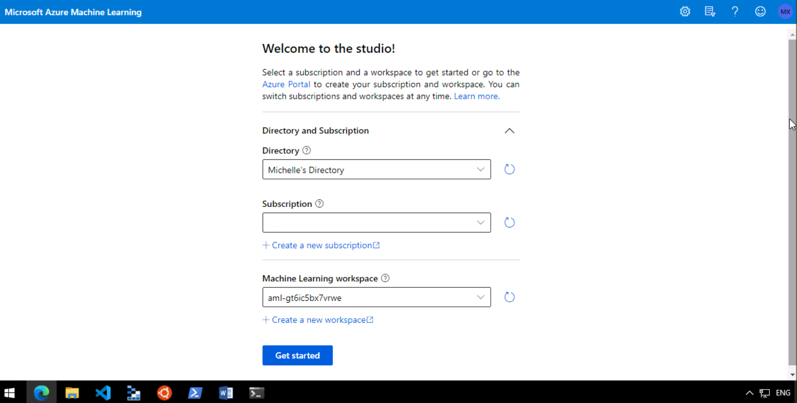
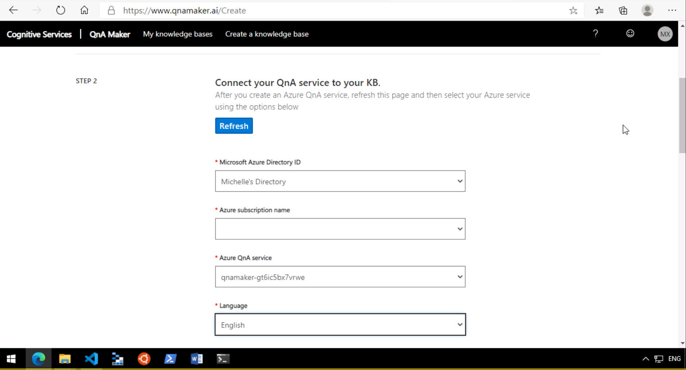

# AI-900
This repository contains ARM templates to automate AI-900 Lab deployments. 

<i>Note: We will be using Azure CLI (or Bash) in Azure Cloud Shell to automate the deployments.</i>

## Lab 1: Azure Machine Learning

Start by signing into your Azure portal: 


In the top bar, click on the cloud shell icon to open up Azure cloud shell. 

<i>Note: You may need to provision storage for your cloud shell if you are opening up Azure cloud shell for the very first time.</i>


Alternatively, you can open up a separate tab and type into your browser: *shell.azure.com*. This will also open up an instance of Azure cloud shell that does not overlay on top of the Azure portal:


Now, from this repository, download a compressed (zip) version of all the folder and files in this repository: 


Unzip the AI-900 folder: 


Back in your Azure cloud shell, go ahead and upload the ml-template.json file to your cloud shell: 


Once the upload has completed (it should only take a second or two), execute the following commands in your Azure cloud shell: 

```azurecli
az group create --name AI-900 --location "East US"
```


That command creates a resource group called 'AI-900' which is where you will provision all your Azure resources for this lab. We have specified the Azure region to use one of the 'East US' datacentres but you are more than welcome to change this if you want. 

Then, execute this command next: 

```azurecli
az deployment group create --name ml-template --resource-group AI-900 --template-file ml-template.json
```


There are a couple of resources that needs to be spun up here so this will take a few minutes. While you wait, this will be a good time to go give your instructors a thumbs up or gif in the chat or make a new batch of tea or coffee or pop off for a quick bathroom break (but not too long)!

Once your resources have deployed, navigate back to your Azure portal and you should see something like this: 


Now, all you have to do is open up Azure Machine Learning Studio and you can go ahead and follow the rest of the Azure Machine Learning lab by accessing the [instructions here](https://docs.microsoft.com/en-us/learn/modules/use-automated-machine-learning/create-compute). Good luck, if you get stuck, remember to let your instructors know!

.


## Lab 2: Computer Vision 

Back in your Azure cloud shell, go ahead and upload the cogservice-template JSON file: 


And then execute the following command in your cloud shell: 
```azurecli
az deployment group create --name cognservice-template --resource-group AI-900 --template-file cogservice-template.json
```


This will deploy an Azure Cognitive Services for you to use for the Computer Vision labs so once provisioned, please go ahead and follow the rest of the [lab instructions from here](https://github.com/MicrosoftDocs/ai-fundamentals/blob/master/01b%20-%20Image%20Classification.ipynb).


Remember, if you run into any issues, don't be shy and ask your instructors! 


## Lab 3: Natural Language Processing 

Again, we go back to our Azure cloud shell and upload the luis-template JSON file: 


Then we simply execute the following command in Azure cloud shell: 

```azurecli
az deployment group create --name luis-template --resource-group AI-900 --template-file luis-template.json
```


Check that your LUIS resources have been provisioned: 


And then away you go! Now you can follow the rest of the [lab instructions from here.](https://github.com/MicrosoftDocs/ai-fundamentals/blob/master/02d%20-%20Language%20Understanding.ipynb)


## Lab 4: Conversational-AI <i>(or Bots really)</i>

Ok, bear with me. I know this is meant to be automated but this will be the last ARM template you have to deploy. Now, again go back to your Azure cloud shell and upload the qna-template JSON file: 


And then go ahead and execute the following command: 
```azurecli
az deployment group create --name qna-template --resource-group AI-900 --template-file qna-template.json
```


Just to be sure, double check your resources are provisioned on Azure: 


Then go and open up [QnA Maker](https://www.qnamaker.ai/) and follow the rest of the [lab instructions from here.](https://github.com/MicrosoftDocs/ai-fundamentals/blob/master/03a%20-%20QnA%20Bot.ipynb)



## Once you have finished the labs! 

First all, big kudos to you. You did it. Now, it wasn't that hard, was it? 

Second of all, and really <u><i>REALLY</i></u> important is to make sure you delete your resource group to stop your Azure costs from running too wildly espeically if you have used an Azure subscription you are paying for yourself to do these labs. 

Now, it's really simple, just enter one last command into your Azure cloud shell before you shut off for the day: 

```azurecli
az group delete --name AI-900
```


And you're done. Yes, really <u><i>REALLY</i></u> done this time. 

Well done and all the best with your AI endeavors (hopefully on Azure). 

